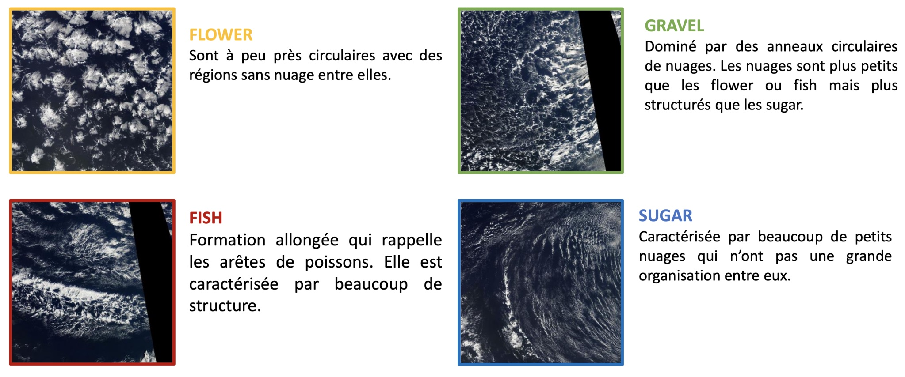
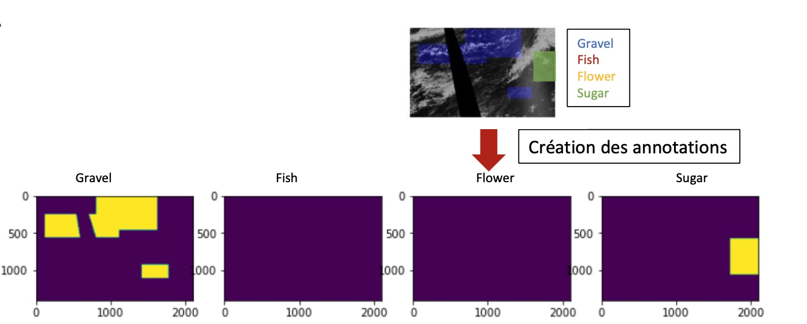
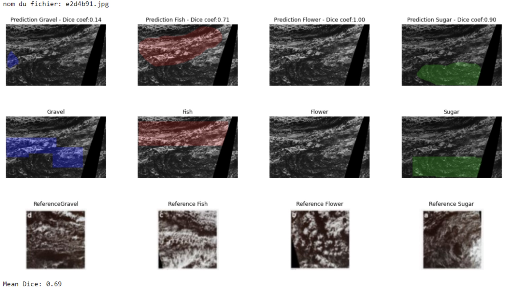
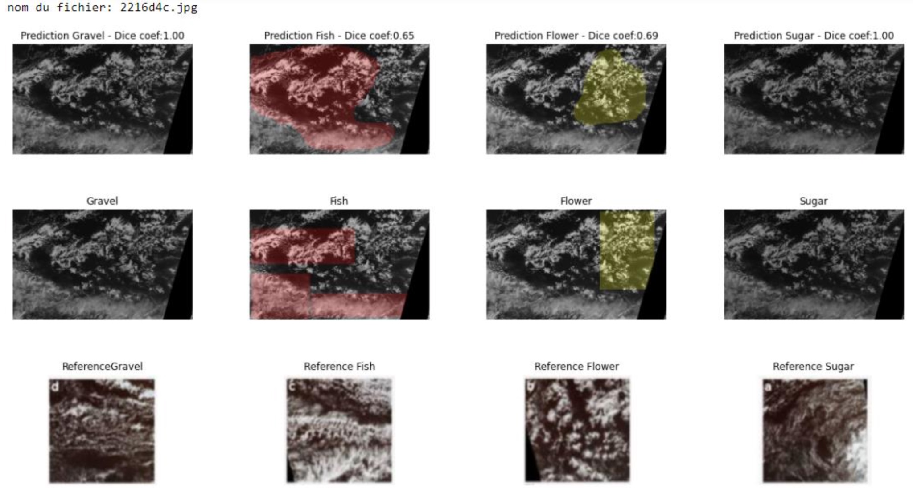

# CloudSegmentation

This porject is based on the Kaggle competiton Understanding clouds formation: https://www.kaggle.com/c/understanding_cloud_organization/overview

It was done in colaoration with Laurent LABORDE and Alexandre HACHE form November 2020 to January 2021. 

In this respeitory you will find 2 jupyter notebooks:
  - Functions: Contains all the function and classes used in this project
  - CloudFormations: Contains the dataviz and model setup

A french version of the process and results is alvailable here:  https://alexlenfant.wordpress.com/2021/01/15/example-post-3/

